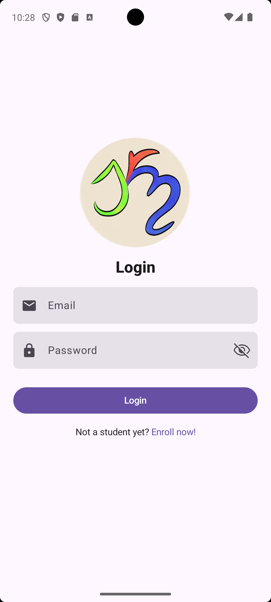
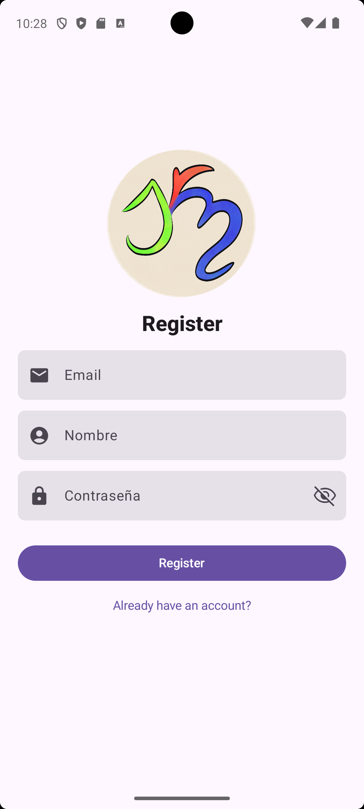

# Lightning App :rocket:  

[](https://kotlinlang.org/)  
[](https://developer.android.com/jetpack/compose)  
[](https://firebase.google.com/)  

**Lightning** es una aplicación de Android moderna diseñada para la gestión de actividades y sincronización en tiempo real.  
Construida bajo los principios de **Clean Architecture** y las últimas tendencias en desarrollo nativo.

---

## Capturas de Pantalla

| Login | Registro |
|-------|----------|
|  |  |
---

## ❇️: Características

- **Autenticación:**  
  Sistema de Login y Registro seguro mediante Firebase Auth.

- **Base de Datos en Tiempo Real:**  
  Gestión de actividades (CRUD) sincronizada con Cloud Firestore.

- **Arquitectura Limpia:**  
  Separación estricta de responsabilidades (Data, Domain, Presentation).

- **Inyección de Dependencias:**  
  Gestión eficiente de componentes con Koin.

- **UI Reactiva:**  
  Interfaz construida íntegramente con Jetpack Compose y Material3.

---

## 🧰: Stack Tecnológico

- **Lenguaje:** Kotlin + Corrutinas & Flow.  
- **UI:** Jetpack Compose (Material 3).  
- **Backend:** Firebase Authentication & Cloud Firestore.  
- **DI:** Koin (Dependency Injection).  
- **Navegación:** Jetpack Navigation Compose.  
- **Arquitectura:** MVVM (Model-View-ViewModel) + Use Cases.

---

## 🏗️: Estructura del Proyecto

```text
app/
├── data/          # Implementación de repositorios y fuentes de datos (Firebase)
├── domain/        # Modelos de negocio y Use Cases (Lógica pura)
├── presentation/  # UI (Screens, ViewModels, Theme)
└── di/            # Módulos de Koin
```

---

## 🚀 Instalación

1. Clona el repositorio:

```bash
git clone https://github.com/tu-usuario/wargame-app.git
```

2. Añade tu archivo `google-services.json` en la carpeta `app/`.

3. Compila y ejecuta en Android Studio.

---

Creado por **Alejandro Zagastizabal**  
Estudiante de FP DAM.

